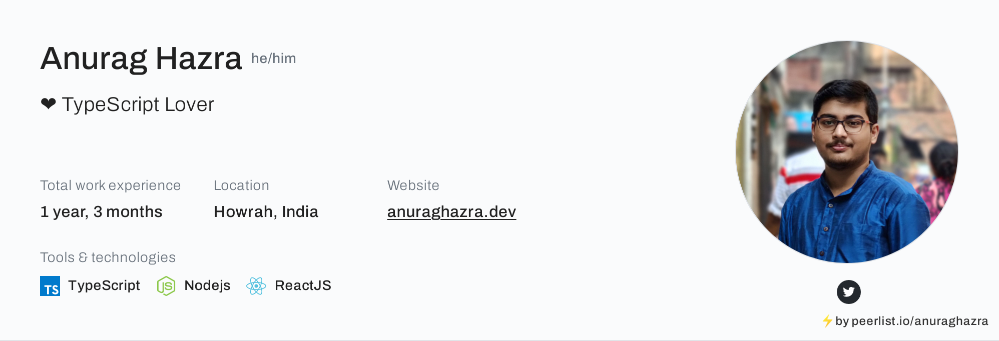

<p align="center">
 
 <h2 align="center">Peerlist Profile Action</h2>
 <p align="center">Get dynamically generated peerlist.io profile overview on your readmes!</p>
</p>
  <p align="center">
    <a href="https://github.com/anuraghazra/peerlist-profile-action/issues">
      
    </a>
    <a href="https://github.com/anuraghazra/peerlist-profile-action/pulls">
      
    </a>
  </p>

  <p align="center">
    <a href="#demo">View Demo</a>
    ·
    <a href="https://github.com/anuraghazra/peerlist-profile-action/issues/new/choose">Report Bug</a>
    ·
    <a href="https://github.com/anuraghazra/peerlist-profile-action/issues/new/choose">Request Feature</a>
  </p>
</p>
<p align="center">Love the project? Please consider <a href="https://github.com/sponsors/anuraghazra">sponsoring</a> to help it improve!


-------

A GitHub action to get [peerlist.io](https://peerlist.io) profile overview on your readmes.


[](https://peerlist.io/anuraghazra)

## Usage

see [action.yml](./action.yml)

Inside `.github/workflows` folder create a new workflow called `peerlist-overview.yml` and copy paste this content: 

```yml
name: 'peerlist-overview'
on:
  schedule:
    # run every day at 12
    - cron: "0 0 * * *"
  
jobs:
  peerlist-run:
    name: Generate peerlist overview
    runs-on: ubuntu-latest
    steps:
      - uses: actions/checkout@v2
      - uses: browser-actions/setup-chrome@latest
      - uses: 'anuraghazra/peerlist-profile-action@latest'
        with:
          token: ${{ secrets.GITHUB_TOKEN }}
          username: 'anuraghazra' # your peerlist username
```

After running the action, it will automatically create a commit and upload it to the repo. And you can import that image to markdown.

> default output path is `./images/peerlist-profile.png` you can change it with by passing `output_path`
  
```md
[](https://peerlist.io/your_username)
```

## All options

- **username** - Peerlist username 
- **output_path** - Output path to upload the image
- **card_size** - Card size (sm, md, lg) or any number
- **token** - GitHub access token
- **theme_name** - name of the theme, choose from all available themes
- **title_color** - Card's title color (without #)
- **text_color** - Body text color (without #)
- **bg_color** - Card's background color (without #)
- **branch** - Branch which you want to upload the image, change it depending on your main branch (default: main)


## Manual trigger example

If you wan't run the action with different parameters without chaning the workflow file everytime, you can make use of [workflow_dispatch](https://docs.github.com/en/actions/learn-github-actions/events-that-trigger-workflows#workflow_dispatch) event.

See [demo action with workflow_dispatch](./.github/workflows/demo.yml)

-----

**Huge shoutout to peerlist.io for their amazing platform.**

Made with :heart: & TypeScript